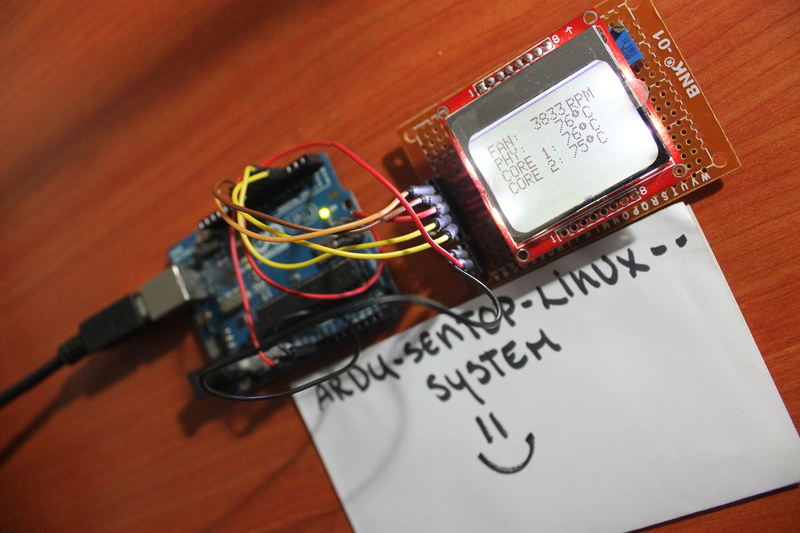

# ardu-sentop-linux-system
This project show temperature, memory and percentage of used info in your Linux/GNU system. 

## Hardware Parts ##

* PCD8544/5110 LCD
* Arduino UNO 

## Connections ##

Arduino UNO|PCD8544/Nokia 5110 |Description
-----------|-----------|-------------------------------------------------------------
GND        |GND        |Ground
3V         |VCC        |3.3V
 3         |CLK        |Output from Arduino SPI clock
 4         |DIN        |Output from Arduino SPI MOSI to display data input
 5         |D/C        |Output from display data/command to Arduino
 6         |CE         |Output from Arduino to chip select/enable display
 7         |RST        |Output from Arduino to reset display

## Dependencies ##

* [psutil]
  (https://github.com/giampaolo/psutil).
* [pysensors]
  (https://github.com/bastienleonard/pysensors).